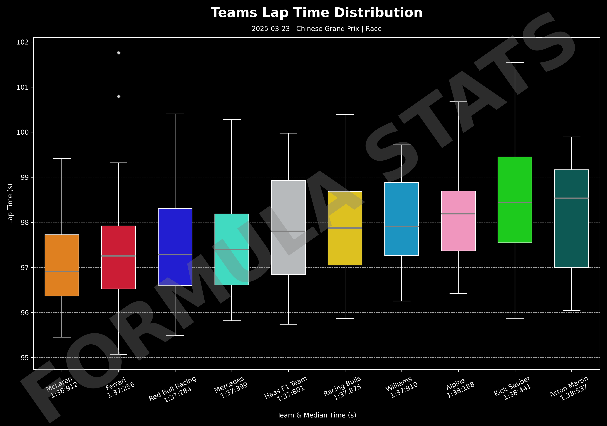
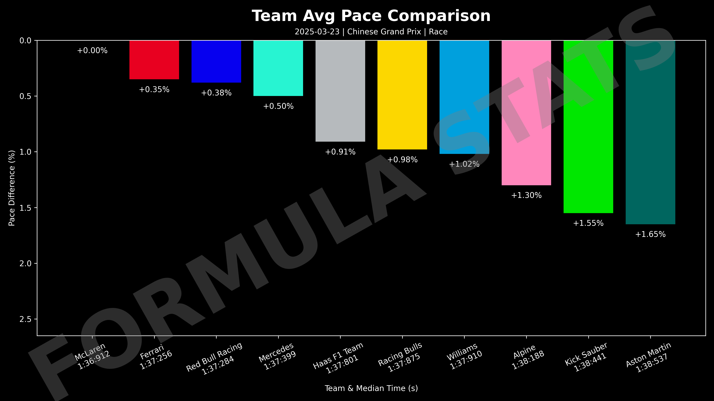
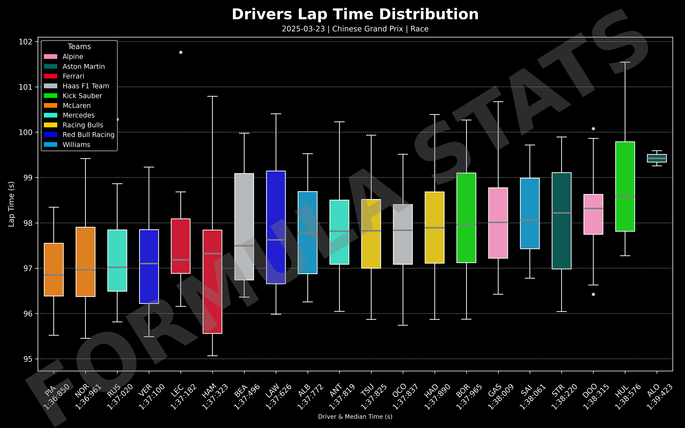
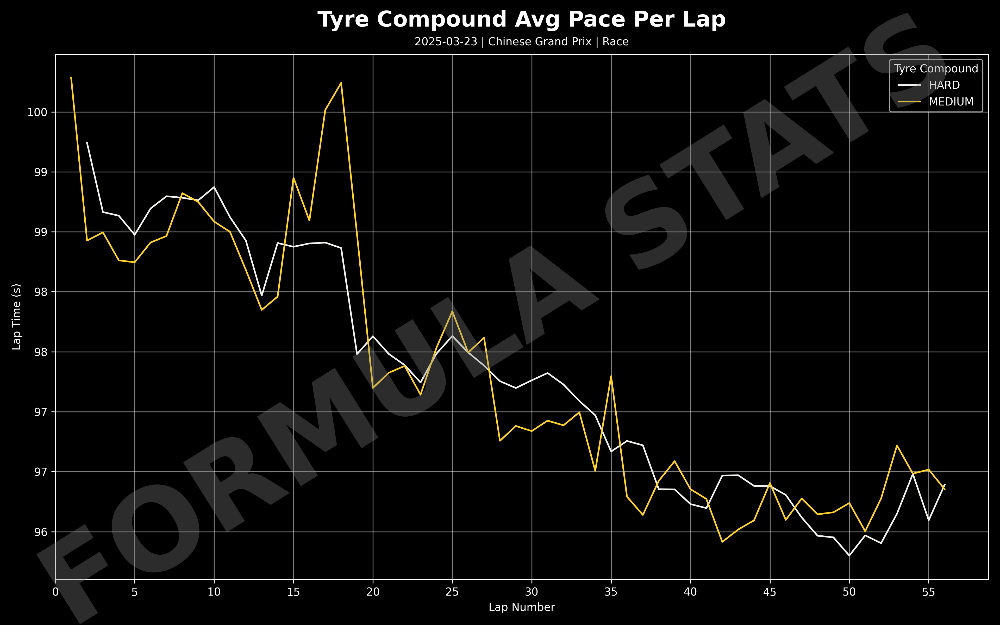
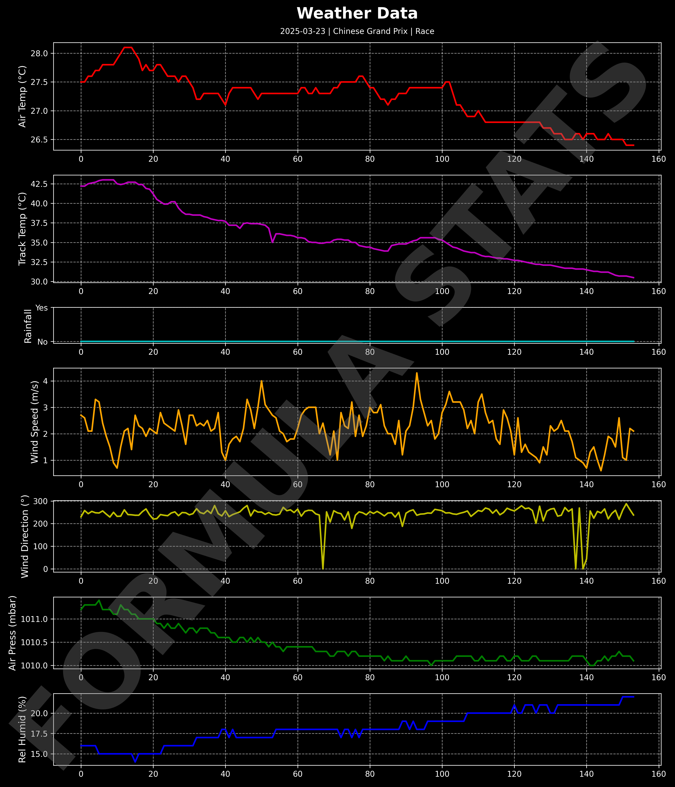
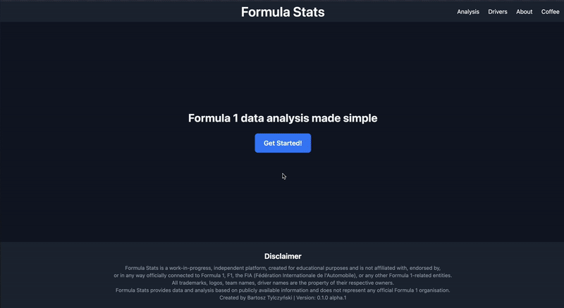

# 🏎️ Formula Stats

_"To make Formula 1 data analysis simple and accessible."_

An open source Django-based web application for exploring Formula 1 data. Making F1 data analytics simple and acccessible. Lightweight site focused on clean, race visuals using telemetry and lap data. Behind the scenes, it runs on a PostgreSQL database storing complete F1 data—from historical race results to detailed car telemetry.

**First public release is coming soon!**

## 🚀 Features

- **Easy Visualisations**: Explore detailed, plots of lap times, telemetry, tyre usage, weather data and more for every race weekend.
- **Downloadable Graphics**: Export high-quality images of all charts and graphics for easy sharing or further analysis.
- **Custom Date & Event Filtering**: Select any season, event, or session to tailor your data exploration.
- **User-Friendly Interface**: Clean, responsive design powered by Tailwind CSS for a seamless experience on desktop and mobile.
- **Extensible Architecture**: Modular Django app structure enables easy addition of new metrics, visualisations, and data sources.
- **Command Line Data Import**: Convenient Django management commands automate data importing and updating from FastF1.
- **Open Source & Community Driven**: Contributions are welcome to expand features, fix bugs, and improve documentation.

## 🔮 Roadmap
Planned features include:
- **Predictive Race Modelling**: Implement machine learning algorithms to forecast race outcomes, pit stop strategies, and driver performance under varying conditions.
- **Enhanced Driver and Team Comparison Tools**: Interactive dashboards to compare driver and constructor stats across multiple seasons, tracks, and race sessions with detailed visual insights.
- **Advanced Statistics and Metrics**: Incorporate deeper performance indicators such as stint analysis, tyre degradation models, sector performance trends, and aerodynamic efficiency metrics.
- **Live Data Integration**: Explore options to integrate near real-time telemetry and race data during live events for up-to-the-minute analysis.

## 🛠 Tech Stack

- **Backend**: Python 3, Django, FastF1
- **Frontend**: Tailwind CSS, Django-HTML templates
- **Database**: PostgreSQL
- **Other**: Django management commands, Matplotlib, Seaborn, Pandas, Numpy

## 🧱 Project Structure

```
formula_stats_django/                      # Main Django project folder
├── formula_stats/                         # Core project configuration
│   ├── __init__.py
│   ├── asgi.py
│   ├── settings.py                        # Project settings
│   ├── urls.py                            # Root URL routing
│   └── wsgi.py
│
├── frontend/                              # Frontend app: templates, views, UI logic
│   ├── templates/                         # HTML templates
│   │   ├── about.html
│   │   ├── analysis.html
│   │   ├── base.html
│   │   ├── drivers.html
│   │   └── home.html
│   ├── templatetags/                      # Custom Django template tags
│   │   ├── __init__.py
│   │   └── template_tags.py
│   ├── __init__.py
│   ├── apps.py
│   ├── urls.py
│   └── views.py
│
├── static_data/                           # Backend app: models and data ingestion
│   ├── management/commands/               # Custom Django management commands
│   │   └── import_fastf1_data.py
│   ├── migrations/
│   ├── __init__.py
│   ├── apps.py
│   └── models.py
│
├── static_visuals/                        # Plotting and visualisation logic
│   ├── plotting/                          # Modular scripts for different plots
│   │   ├── driver_pace_lap_times.py
│   │   ├── team_pace_lap_times.py
│   │   ├── telemetry.py
│   │   ├── tyres.py
│   │   └── weather.py
│   ├── __init__.py
│   └── apps.py
│
├── manage.py                              # Django CLI entry point
├── screenshots/                           # Screenshots and walkthroughs
├── .gitignore                             # Git ignore rules
├── requirements.txt                       # Python package dependencies
└── README.md                              # Project documentation                                 
```

## 🗃️ Database Schema
You can view the full interactive database schema on dbdiagram.io: 🔗 [Click here to view the schema](https://dbdiagram.io/d/Formula-Stats-DB-67f1919a4f7afba1847a317f)

## 🧰 Dependencies
Install required packages with:
```
pip install -r requirements.txt
```

## 🤝 Contributing
Pull requests are welcome! For major changes, please open an issue first to discuss what you'd like to change.

## ▶️ Running the App
Navigate to the correct directory and launch the app with:
```
python manage.py runserver
```

## 📥 Imporing Data to the Database
To populate the database with missing data, you can use the custom Django management command. For example, to import data for the 2024 Australian Grand Prix, run:
```
python manage.py import_fastf1_data --year 2024 --event Australia
```
This command fetches and updates the database with all available sessions for the specified event and year.

## 📸 Example Visuals
### Team Analysis
<p align="center">
  
  
</p>

### Driver Analysis


### Tyre Analysis


### Weather Analysis


### 🎥 Walkthrough


## ✍🏻 Acknowledgements ##
This project uses data provided by the FastF1 library, created and maintained by Theo Ehrlich. Huge thanks to the FastF1 community for making detailed F1 data accessible for analysis and visualisation.

## 👨🏻‍💻 Author
Bartosz Tylczynski – UoL Computer Science student, Formula 1 strategy & data enthusiast.

## 📄 License
MIT License – feel free to use, adapt, and expand this project. Credit required.

## ‼️ Disclaimer
Formula Stats is a work-in-progress, independent platform, created for educational purposes and is not affiliated with, endorsed by,
or in any way officially connected to Formula 1, F1, the FIA (Fédération Internationale de l'Automobile), or any other Formula 1-related entities.
All trademarks, logos, team names, driver names are the property of their respective owners.
Formula Stats provides data and analysis based on publicly available information and does not represent any official Formula 1 organisation.
